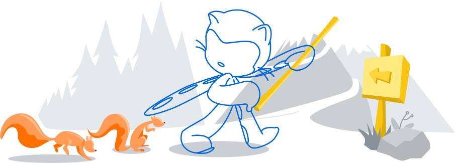

<!-- Walter Guithub Profile @ Walterxrobot -->


<a href="#"></a>
<h1 align="center">Hi 👋, I'm Walter 🇮🇳</h1>
<h3 align="center">"A passionate frontend future developer from India"</h3>
<br>


<p align="center">
 


  
 
 


</p>


<hr>


[](https://google.com/)


- 🔭 I’m currently working on **Telegram Bots**

- 🌱 I’m currently learning **Python**

- 🤝 I’m collaborated with **Darkz Bots**

- 👨‍💻 All of my projects are available at [Here](https://github.com/walterxrobot)

- 💬 Ask me about **Telegram, Bots, Python**

- 🐱‍👤 Regularly make projects on Github

- 📫 How to reach me [Click Here](walterlewin@gmail.com)

- 🐱‍🏍 Readme can be best viewed using **Dark mode**

- ⚡ Fun fact **I love coding and programming**

<hr>

<p align="left">
  <a href="https://heroku.com/deploy?template=https://github.com/walterxrobot/Music-Bot/tree/main">
    
</p>


<a href="#"></a>
<hr>

<p align="left">
  <a href="https://heroku.com/deploy?template=https://github.com/walterxrobot/Music-Bot/tree/main">
    
</p>
 

<div align="center">
 
 <br>
 


 


</div>

<hr>

<!-- BLOG-POST-LIST:START -->
<!-- BLOG-POST-LIST:END -->


<p align="left">
  <a href="https://heroku.com/deploy?template=https://github.com/walterxrobot/Music-Bot/tree/main">
    
</p>


<p align="center"> <a href="https://aws.amazon.com/amplify/" target="_blank">  </a> <a href="https://appwrite.io" target="_blank">  </a> <a href="https://www.arduino.cc/" target="_blank">  </a> <a href="https://aws.amazon.com" target="_blank">  </a> <a href="https://azure.microsoft.com/en-in/" target="_blank">  </a> <a href="https://www.gnu.org/software/bash/" target="_blank">  </a> <a href="https://www.cprogramming.com/" target="_blank">  </a> <a href="https://circleci.com" target="_blank">  </a> <a href="https://www.w3schools.com/cpp/" target="_blank">  </a> <a href="https://www.w3schools.com/cs/" target="_blank">  </a> <a href="https://www.w3schools.com/css/" target="_blank">  </a> <a href="https://www.djangoproject.com/" target="_blank">  </a> <a href="https://www.docker.com/" target="_blank">  </a> <a href="https://dotnet.microsoft.com/" target="_blank">  </a> <a href="https://firebase.google.com/" target="_blank">  </a> <a href="https://cloud.google.com" target="_blank">  </a> <a href="https://git-scm.com/" target="_blank">  </a> <a href="https://golang.org" target="_blank">  </a> <a href="https://heroku.com" target="_blank">  </a> <a href="https://www.w3.org/html/" target="_blank">  </a> <a href="https://www.adobe.com/in/products/illustrator.html" target="_blank">  </a> <a href="https://www.java.com" target="_blank">  </a> <a href="https://developer.mozilla.org/en-US/docs/Web/JavaScript" target="_blank">  </a> <a href="https://www.jenkins.io" target="_blank">  </a> <a href="https://kubernetes.io" target="_blank">  </a> <a href="https://www.linux.org/" target="_blank">  </a> <a href="https://www.mongodb.com/" target="_blank">  </a> <a href="https://www.microsoft.com/en-us/sql-server" target="_blank">  </a> <a href="https://www.mysql.com/" target="_blank">  </a> <a href="https://nodejs.org" target="_blank">  </a> <a href="https://www.oracle.com/" target="_blank">  </a> <a href="https://www.photoshop.com/en" target="_blank">  </a> <a href="https://www.php.net" target="_blank">  </a> <a href="https://www.postgresql.org" target="_blank">  </a> <a href="https://www.python.org" target="_blank">  </a> <a href="https://redis.io" target="_blank">  </a> <a href="https://www.ruby-lang.org/en/" target="_blank">  </a> <a href="https://www.scala-lang.org" target="_blank">  </a> <a href="https://www.tensorflow.org" target="_blank">  </a> <a href="https://travis-ci.org" target="_blank">  </a> <a href="https://www.typescriptlang.org/" target="_blank">  </a> <a href="https://www.vagrantup.com/" target="_blank">  </a> <a href="https://vuejs.org/" target="_blank">  </a> <a href="https://www.adobe.com/products/xd.html" target="_blank">  </a> </p>

<hr>

 
 <p align="left">
  <a href="https://heroku.com/deploy?template=https://github.com/walterxrobot/Music-Bot/tree/main"></a>
    
</p>
 

 
 
 

 <p align=left>


 


 

 

 

 
 

</p>
<hr>


  <details>
  <summary><b>Credits of my github profile page</b></summary>
 
- Walter(Meh)
 
- Rahul Jain
 
- Ye Chan Kang
 
- Anuraghaza

</details>

<br>

<details>
  <summary><b>License of my profile.</b></summary>
 
 <br>
 
𝗠𝗜𝗧 𝗟𝗶𝗰𝗲𝗻𝘀𝗲

𝗖𝗼𝗽𝘆𝗿𝗶𝗴𝗵𝘁 (𝗰) 𝟮𝟬𝟮𝟭 𝗪𝗮𝗹𝘁𝗲𝗿 𝗟𝗲𝘄𝗶𝗻

𝗣𝗲𝗿𝗺𝗶𝘀𝘀𝗶𝗼𝗻 𝗶𝘀 𝗵𝗲𝗿𝗲𝗯𝘆 𝗴𝗿𝗮𝗻𝘁𝗲𝗱, 𝗳𝗿𝗲𝗲 𝗼𝗳 𝗰𝗵𝗮𝗿𝗴𝗲, 𝘁𝗼 𝗮𝗻𝘆 𝗽𝗲𝗿𝘀𝗼𝗻 𝗼𝗯𝘁𝗮𝗶𝗻𝗶𝗻𝗴 𝗮 𝗰𝗼𝗽𝘆
𝗼𝗳 𝘁𝗵𝗶𝘀 𝘀𝗼𝗳𝘁𝘄𝗮𝗿𝗲 𝗮𝗻𝗱 𝗮𝘀𝘀𝗼𝗰𝗶𝗮𝘁𝗲𝗱 𝗱𝗼𝗰𝘂𝗺𝗲𝗻𝘁𝗮𝘁𝗶𝗼𝗻 𝗳𝗶𝗹𝗲𝘀 (𝘁𝗵𝗲 "𝗦𝗼𝗳𝘁𝘄𝗮𝗿𝗲"), 𝘁𝗼 𝗱𝗲𝗮𝗹
𝗶𝗻 𝘁𝗵𝗲 𝗦𝗼𝗳𝘁𝘄𝗮𝗿𝗲 𝘄𝗶𝘁𝗵𝗼𝘂𝘁 𝗿𝗲𝘀𝘁𝗿𝗶𝗰𝘁𝗶𝗼𝗻, 𝗶𝗻𝗰𝗹𝘂𝗱𝗶𝗻𝗴 𝘄𝗶𝘁𝗵𝗼𝘂𝘁 𝗹𝗶𝗺𝗶𝘁𝗮𝘁𝗶𝗼𝗻 𝘁𝗵𝗲 𝗿𝗶𝗴𝗵𝘁𝘀
𝘁𝗼 𝘂𝘀𝗲, 𝗰𝗼𝗽𝘆, 𝗺𝗼𝗱𝗶𝗳𝘆, 𝗺𝗲𝗿𝗴𝗲, 𝗽𝘂𝗯𝗹𝗶𝘀𝗵, 𝗱𝗶𝘀𝘁𝗿𝗶𝗯𝘂𝘁𝗲, 𝘀𝘂𝗯𝗹𝗶𝗰𝗲𝗻𝘀𝗲, 𝗮𝗻𝗱/𝗼𝗿 𝘀𝗲𝗹𝗹
𝗰𝗼𝗽𝗶𝗲𝘀 𝗼𝗳 𝘁𝗵𝗲 𝗦𝗼𝗳𝘁𝘄𝗮𝗿𝗲, 𝗮𝗻𝗱 𝘁𝗼 𝗽𝗲𝗿𝗺𝗶𝘁 𝗽𝗲𝗿𝘀𝗼𝗻𝘀 𝘁𝗼 𝘄𝗵𝗼𝗺 𝘁𝗵𝗲 𝗦𝗼𝗳𝘁𝘄𝗮𝗿𝗲 𝗶𝘀
𝗳𝘂𝗿𝗻𝗶𝘀𝗵𝗲𝗱 𝘁𝗼 𝗱𝗼 𝘀𝗼, 𝘀𝘂𝗯𝗷𝗲𝗰𝘁 𝘁𝗼 𝘁𝗵𝗲 𝗳𝗼𝗹𝗹𝗼𝘄𝗶𝗻𝗴 𝗰𝗼𝗻𝗱𝗶𝘁𝗶𝗼𝗻𝘀:

𝗧𝗵𝗲 𝗮𝗯𝗼𝘃𝗲 𝗰𝗼𝗽𝘆𝗿𝗶𝗴𝗵𝘁 𝗻𝗼𝘁𝗶𝗰𝗲 𝗮𝗻𝗱 𝘁𝗵𝗶𝘀 𝗽𝗲𝗿𝗺𝗶𝘀𝘀𝗶𝗼𝗻 𝗻𝗼𝘁𝗶𝗰𝗲 𝘀𝗵𝗮𝗹𝗹 𝗯𝗲 𝗶𝗻𝗰𝗹𝘂𝗱𝗲𝗱 𝗶𝗻 𝗮𝗹𝗹
𝗰𝗼𝗽𝗶𝗲𝘀 𝗼𝗿 𝘀𝘂𝗯𝘀𝘁𝗮𝗻𝘁𝗶𝗮𝗹 𝗽𝗼𝗿𝘁𝗶𝗼𝗻𝘀 𝗼𝗳 𝘁𝗵𝗲 𝗦𝗼𝗳𝘁𝘄𝗮𝗿𝗲.

𝗧𝗛𝗘 𝗦𝗢𝗙𝗧𝗪𝗔𝗥𝗘 𝗜𝗦 𝗣𝗥𝗢𝗩𝗜𝗗𝗘𝗗 "𝗔𝗦 𝗜𝗦", 𝗪𝗜𝗧𝗛𝗢𝗨𝗧 𝗪𝗔𝗥𝗥𝗔𝗡𝗧𝗬 𝗢𝗙 𝗔𝗡𝗬 𝗞𝗜𝗡𝗗, 𝗘𝗫𝗣𝗥𝗘𝗦𝗦 𝗢𝗥
𝗜𝗠𝗣𝗟𝗜𝗘𝗗, 𝗜𝗡𝗖𝗟𝗨𝗗𝗜𝗡𝗚 𝗕𝗨𝗧 𝗡𝗢𝗧 𝗟𝗜𝗠𝗜𝗧𝗘𝗗 𝗧𝗢 𝗧𝗛𝗘 𝗪𝗔𝗥𝗥𝗔𝗡𝗧𝗜𝗘𝗦 𝗢𝗙 𝗠𝗘𝗥𝗖𝗛𝗔𝗡𝗧𝗔𝗕𝗜𝗟𝗜𝗧𝗬,
𝗙𝗜𝗧𝗡𝗘𝗦𝗦 𝗙𝗢𝗥 𝗔 𝗣𝗔𝗥𝗧𝗜𝗖𝗨𝗟𝗔𝗥 𝗣𝗨𝗥𝗣𝗢𝗦𝗘 𝗔𝗡𝗗 𝗡𝗢𝗡𝗜𝗡𝗙𝗥𝗜𝗡𝗚𝗘𝗠𝗘𝗡𝗧. 𝗜𝗡 𝗡𝗢 𝗘𝗩𝗘𝗡𝗧 𝗦𝗛𝗔𝗟𝗟 𝗧𝗛𝗘
𝗔𝗨𝗧𝗛𝗢𝗥𝗦 𝗢𝗥 𝗖𝗢𝗣𝗬𝗥𝗜𝗚𝗛𝗧 𝗛𝗢𝗟𝗗𝗘𝗥𝗦 𝗕𝗘 𝗟𝗜𝗔𝗕𝗟𝗘 𝗙𝗢𝗥 𝗔𝗡𝗬 𝗖𝗟𝗔𝗜𝗠, 𝗗𝗔𝗠𝗔𝗚𝗘𝗦 𝗢𝗥 𝗢𝗧𝗛𝗘𝗥
𝗟𝗜𝗔𝗕𝗜𝗟𝗜𝗧𝗬, 𝗪𝗛𝗘𝗧𝗛𝗘𝗥 𝗜𝗡 𝗔𝗡 𝗔𝗖𝗧𝗜𝗢𝗡 𝗢𝗙 𝗖𝗢𝗡𝗧𝗥𝗔𝗖𝗧, 𝗧𝗢𝗥𝗧 𝗢𝗥 𝗢𝗧𝗛𝗘𝗥𝗪𝗜𝗦𝗘, 𝗔𝗥𝗜𝗦𝗜𝗡𝗚 𝗙𝗥𝗢𝗠,
𝗢𝗨𝗧 𝗢𝗙 𝗢𝗥 𝗜𝗡 𝗖𝗢𝗡𝗡𝗘𝗖𝗧𝗜𝗢𝗡 𝗪𝗜𝗧𝗛 𝗧𝗛𝗘 𝗦𝗢𝗙𝗧𝗪𝗔𝗥𝗘 𝗢𝗥 𝗧𝗛𝗘 𝗨𝗦𝗘 𝗢𝗥 𝗢𝗧𝗛𝗘𝗥 𝗗𝗘𝗔𝗟𝗜𝗡𝗚𝗦 𝗜𝗡 𝗧𝗛𝗘
𝗦𝗢𝗙𝗧𝗪𝗔𝗥𝗘.

</details>

 
 <hr>
 
 **I'm a Night 🦉** 
```text
🌞 Morning    67 commits     ███░░░░░░░░░░░░░░░░░░░░░░   13.14% 
🌆 Daytime    132 commits    ██████░░░░░░░░░░░░░░░░░░░   25.88% 
🌃 Evening    157 commits    ███████░░░░░░░░░░░░░░░░░░   30.78% 
🌙 Night      154 commits    ███████░░░░░░░░░░░░░░░░░░   30.2%
```
<hr>




<br>

<p align=center><b>Made With ❤️ Walter © Copyright 2021</b></p>


<!--End Of Readme-->
